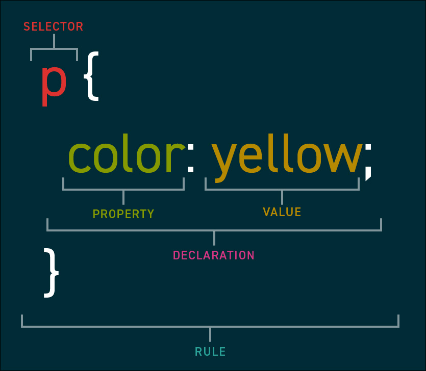

# What is CSS?

CSS is what brings beauty and aesthetic to websites. Without it, most pages would just read like a top down list of text with no real hiearchy.

A few things CSS can do are:
- Colors
- Fonts
- Size
- Positioning
- Spacing

<small><em>(there's more, but these are the basics)</em></small>

## The World Without CSS

It's easiest to see the effect of CSS by [turning it off](https://css-tricks.com/that-time-i-tried-browsing-the-web-without-css/) as you browse your favorite site. Here are a few images from that article:

### Wikipedia

<small>The Wikipedia homepage with CSS (left) and without CSS (right).</small>


### GitHub

<br />
<small>A GitHub repository page in a logged out state.</small>

<br />

## How does it work?
CSS works by creating rules and applying those rules to elements on the page.

For example, you say,
> All paragraphs on the page should be blue.

And so the browser makes it so. In code, that statement looks like,
```css
p {
  color: yellow;
}
```

Let's take a moment to break down that code piece by piece using some key definitions:

- **Stylesheet**: A document full of style rules which tell the browser how to style and format a page of elements. Page's are not limited to only having a single stylesheet. They are made up of **rules**.
- **Rule**: A specific set of instructions given to a browser about how a specific set of elements should be styled. They are made up of one or more **selectors** combined with one or more **declarations**.
- **Selector**: The specific element(s) a rule should be applied to (the "Who").
- **Declaration**: One specific instruction of how the element(s) should be displayed (the "How"). They are made up of a **property** and a **value**.
- **Property**: A set of predetermined keywords that indicate the aspect of the element you want to set.
- **Value**: The setting you want to use for the chosen property. Each property has it's own set of accetable values.
<br /><br />


<br /><br />

In the following sections we'll break down each of these in more detail.

## How does it get on the page?
Once you have one or more stylesheets, you can load them onto an HTML page in two ways. We'll be starting off with the "easy way" for the sake of simplicity working through exercises, but in the final section of our class we'll go over the common way most major websites do it.

The easy way is by adding a `<style>` element to your page. Inside that element, you can write CSS code and the element's contents will be treated as a stylesheet, i.e. the text will be interpretted and applied as CSS code.

## Your Turn!
**Excercise 3 – The Style Element.** Apply the following CSS rule to a page by using a style element. The result should be a page where the text in paragraphs are bigger than when it first started, and blue.

```css
p {
  font-size: 24px;
  color: blue;
}
```


<br /><br /><br /><br />

_Editor's Note: We can include the below in section 4_

 The most common way is using a link tag with a reference to where the stylesheet is being hosted. The most common place to host it is as a file right next to your HTML file.

Assuming you have a file structure like this:
```
my-project/
├─ index.html
├─ stylesheet.css
```

Then you would load the stylesheet by adding the following line to the `<head>` element of your `index.html` file,

```
  <head>
    ...

    <link 
      type="text/css" 
      rel="stylesheet" 
      href="./stylesheet.css"
    />

    ...
  </head>
```

The `type` and `rel` attributes will always be the same, but the `href` attribute can be any URL (either relative or absolute). You can read more about [crafting a URL here](https://developer.mozilla.org/en-US/docs/Learn/Common_questions/Web_mechanics/What_is_a_URL).