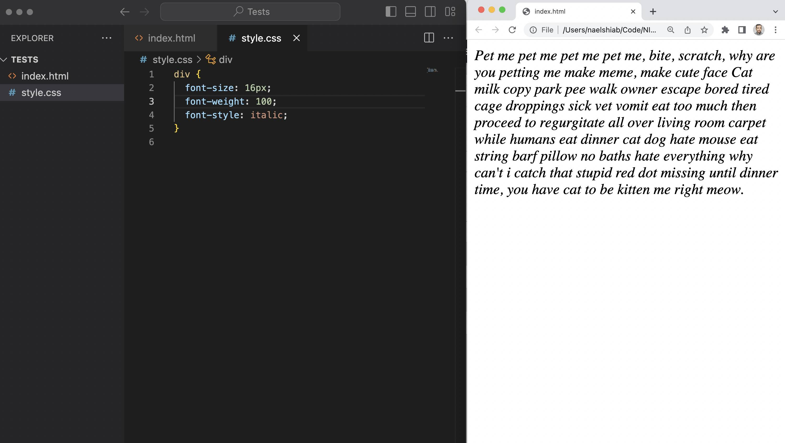
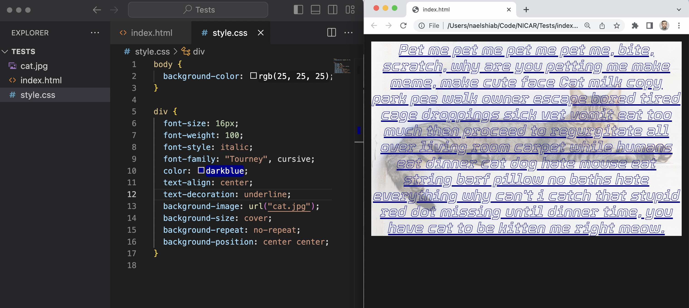
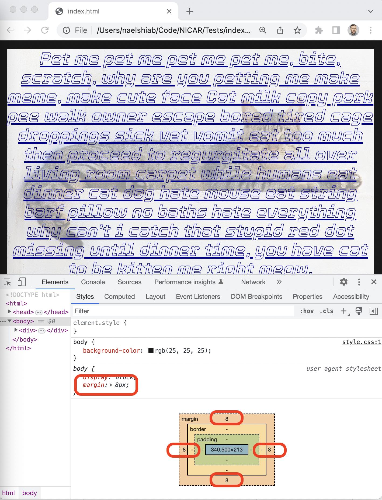
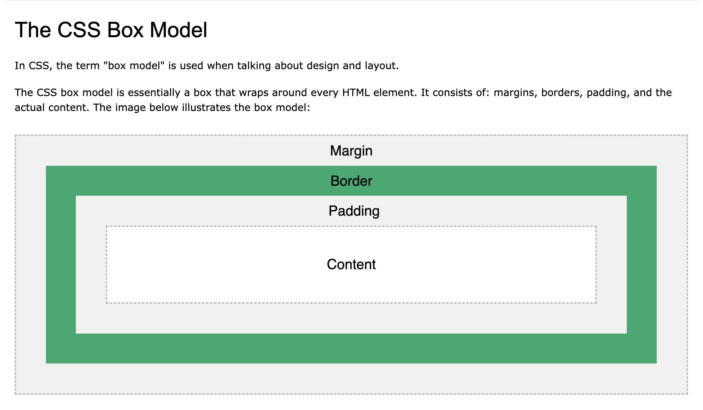
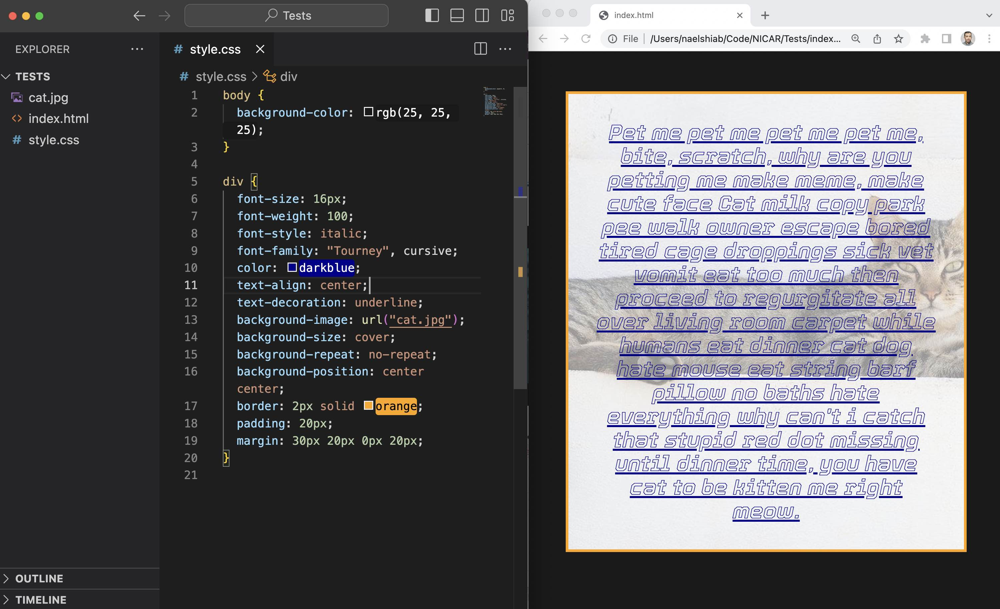
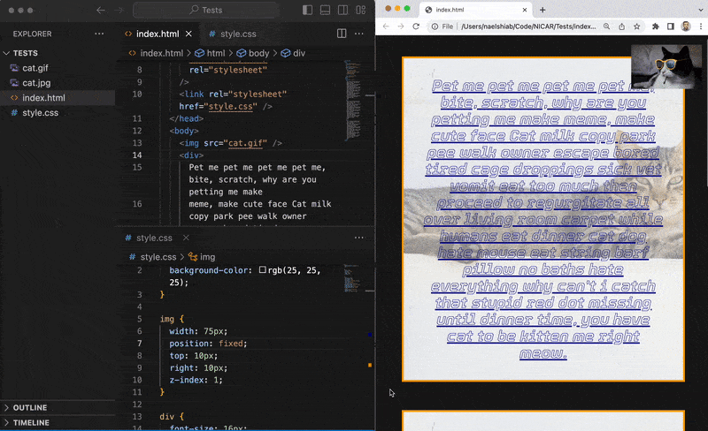

# CSS

## What is it?

To do.

## Selectors

To do.

## CSS Properties

To change the appearance or the behavior of an HTML element, you can assign it a CSS property.

And there are a [loooooot of them](https://www.w3schools.com/cssref/index.php)!

### Setup

To test the main ones, we are going to use a stylesheet and an HTML file.

In the stylesheet, we will add our CSS.

_style.css_

```css
/* Some css in here. */
```

In our HTML file, we need to reference our stylesheet and we will add a simple div element, with some [cat ipsum](http://www.catipsum.com/) in it. This div will be our guinea pig.

_index.html_

```html
<!DOCTYPE html>
<html>
  <head>
    <link rel="stylesheet" href="style.css" />
  </head>
  <body>
    <div>
      Pet me pet me pet me pet me, bite, scratch, why are you petting me make
      meme, make cute face Cat milk copy park pee walk owner escape bored tired
      cage droppings sick vet vomit eat too much then proceed to regurgitate all
      over living room carpet while humans eat dinner cat dog hate mouse eat
      string barf pillow no baths hate everything why can't i catch that stupid
      red dot missing until dinner time, you have cat to be kitten me right
      meow.
    </div>
  </body>
</html>
```

Here's how it looks for now.


### Font properties

These properties allow you to change the properties of the font.

- [font-size](https://www.w3schools.com/cssref/pr_font_font-size.php): the size of the text, usually in pixels.

- [font-weight](https://www.w3schools.com/cssref/pr_font_weight.php): the weight of the text, usually a value between 100 and 900. Normal is 400 and 700 is bold.

- [font-style](https://www.w3schools.com/cssref/pr_font_font-style.php): you can choose between normal, and italic.

In our CSS file, let's add a font-size of 16px, a font-weight of 100, and a font-style italic.



If you want to change the font, you need to overwrite the default font-family property.

- [font-family](https://www.w3schools.com/cssref/pr_font_font-family.php): the font you want to display. [Google Fonts](https://fonts.google.com/) offers a lot of them, for free.

We are going to use the Thin 100 Italic [Tourney font](https://fonts.google.com/specimen/Tourney). Search it and then select it from the Google Fonts website.


Once selected, a panel will open with the code that you need to use to make the font available on your web page.


The first block of code needs to be put in the head of your HTML and the second part of the code in your CSS.

Here's the result!


### Text properties

With CSS, you can change the styling of your text.

- [color](https://www.w3schools.com/css/css_text.asp): you can use a [color name](https://www.w3schools.com/colors/colors_names.asp) (like "pink"), a [HEX value](https://www.w3schools.com/colors/colors_hexadecimal.asp) ("#FFC0CB" is pink), or an [RGB value](https://www.w3schools.com/colors/colors_rgb.asp) ("rgb(255,192,203)" is pink too).

- [text-align](https://www.w3schools.com/css/css_text_align.asp): you can use left, center, justify, or right, to align horizontally your text.

- [text-decoration](https://www.w3schools.com/css/css_text_decoration.asp): you have the choice between underline, line-through, and overline.

Let's update our code with darkblue as a color, center as alignment, and underline for text-decoration.

Looking good!


### Background properties

You can also change the appearance of the whole container.

- [background-color](https://www.w3schools.com/cssref/pr_background-color.php): you can pass it at a color name, HEX value or RGB value.

- [background-image](https://www.w3schools.com/cssref/pr_background-image.php): instead of color, you can use an image as background.

- [background-size](https://www.w3schools.com/cssref/css3_pr_background-size.php): you can specify the size in pixels or percentage (relative to the parent element), but it's more common to use "cover" (cuts or stretches the image to cover the entire container) or "contain" (fits the whole image in the container, even if it doesn't cover the whole container).

- [background-repeat](https://www.w3schools.com/cssref/pr_background-repeat.php): you can decide if the image should be repeated or not with "repeat", "repeat-x", "repeat-y", or "no-repeat".

- [background-position](https://www.w3schools.com/cssref/pr_background-position.php): how you want the image to be positionned. The options are "left top", "left center", "left bottom", "right top", "right center", "right bottom", "center top", "center center", "center bottom".

Let's change our CSS file to add a grey color background to the body element and a picture of a cat as background to our div. You can download the image directly from this repository (./02_CSS/img/properties/cat.jpg).

Here's how it looks now.



### Box properties

Now that we have backgrounds, we can something a bit strange: there's a gap between our cat div and the browser window.

If we inspect our page, and more specifically the body element, we can see that there's a default margin of 8px.



Each HTML elements are a box and you can modify this box with CSS. This is what we call the [CSS Box Model](https://www.w3schools.com/css/css_boxmodel.asp).



Here are the main box properties.

- [width](https://www.w3schools.com/css/css_dimension.asp): controls the width of the element, usually in pixels or percent (relative to the parent element)

- [height](https://www.w3schools.com/css/css_dimension.asp): controls the height of the element, usually in pixels or percent (relative to the parent element)

- [border](https://www.w3schools.com/css/css_border_shorthand.asp): draw the border of the box by specifying the width, the style and the color (for example, "2px grey blue")

- [margin](https://www.w3schools.com/css/css_margin.asp): controls the space between this element and the rest of the page. This space is outside of the element, after the border. Usually in pixels or percent (relative to the width of the element).

- [padding](https://www.w3schools.com/css/css_padding.asp): controls the space inside this element, between the content and the border. Usually in pixels or percent (relative to the width of the element).

For the padding and the margin, if you pass only one value ("10px" for example), it will be applied all around the element. But you can also pass specific values for the top, right, bottom and left sides, in that order ("10px 0px 5px 0px" for example).

In our CSS file, we add a 2 pixels wide orange border, with a solid style. We set the padding to 20 pixels and the margin to 30px on top, 20px on left, 0px on bottom, and 20px again on right.



### Position

HTML elements are positioned static by default, but you can change this property.

- A "fixed" position will position the element relative to the browser viewport. The principal use case is when you want something on top of everything else that follows when the user scrolls.

- An "absolute" position will position the element relative to its parent. Useful when you want to place an element on top of something else.

- A "sticky" position is a mix of "fixed" and "absolute". It will follow when the user scrolls, while staying inside its parent element. Very often used for scrolly telling projects.

- A "relative" position is very often used on parent elements, so any children will refer to them for their positions (among other things).

For more information, check [this documentation](https://www.w3schools.com/css/css_positioning.asp).

When placing elements on top of each other, you often need to adjust the z-index as well. The [z-index](https://www.w3schools.com/css/css_z-index.asp) is the stack order of your elements. The greater the z-index, the higher the element will be in the stack.

To demonstrate this property, we will add a small gif of a cat on the top right corner of the viewport. You can download the gif directly from this repo (./02_CSS/img/properties/cat.gif).

First, add the gif to your HTML file with an img tag. You can place it just before the div.

In the same file, let's create multiple divs so our page is longer. Copy the current div and its content, and then paste it multiple times.

Your HTML should look like this.

```html
<!DOCTYPE html>
<html>
  <head>
    <link rel="preconnect" href="https://fonts.googleapis.com" />
    <link rel="preconnect" href="https://fonts.gstatic.com" crossorigin />
    <link
      href="https://fonts.googleapis.com/css2?family=Tourney:ital,wght@1,100&display=swap"
      rel="stylesheet"
    />
    <link rel="stylesheet" href="style.css" />
  </head>
  <body>
    
    <div>
      Pet me pet me pet me pet me, bite, scratch, why are you petting me make
      meme, make cute face Cat milk copy park pee walk owner escape bored tired
      cage droppings sick vet vomit eat too much then proceed to regurgitate all
      over living room carpet while humans eat dinner cat dog hate mouse eat
      string barf pillow no baths hate everything why can't i catch that stupid
      red dot missing until dinner time, you have cat to be kitten me right
      meow.
    </div>
    <div>
      Pet me pet me pet me pet me, bite, scratch, why are you petting me make
      meme, make cute face Cat milk copy park pee walk owner escape bored tired
      cage droppings sick vet vomit eat too much then proceed to regurgitate all
      over living room carpet while humans eat dinner cat dog hate mouse eat
      string barf pillow no baths hate everything why can't i catch that stupid
      red dot missing until dinner time, you have cat to be kitten me right
      meow.
    </div>
    <div>
      Pet me pet me pet me pet me, bite, scratch, why are you petting me make
      meme, make cute face Cat milk copy park pee walk owner escape bored tired
      cage droppings sick vet vomit eat too much then proceed to regurgitate all
      over living room carpet while humans eat dinner cat dog hate mouse eat
      string barf pillow no baths hate everything why can't i catch that stupid
      red dot missing until dinner time, you have cat to be kitten me right
      meow.
    </div>
  </body>
</html>
```

In your CSS file, add the img tag. We will give it a position "fixed", with a "top" value of 10px (meaning 10px between the image and the top of the viewport) and a "left" value of 10px (meaning 10px between the image and the left side of the viewport).

We are also setting the z-index to 1, to make sure that the gif will be on top.

Your CSS should look like this.

```css
body {
  background-color: rgb(25, 25, 25);
}

img {
  width: 75px;
  position: fixed;
  top: 10px;
  right: 10px;
  z-index: 1;
}

div {
  font-size: 16px;
  font-weight: 100;
  font-style: italic;
  font-family: "Tourney", cursive;
  color: darkblue;
  text-align: center;
  text-decoration: underline;
  background-image: url("cat.jpg");
  background-size: cover;
  background-repeat: no-repeat;
  background-position: center center;
  border: 2px solid orange;
  padding: 20px;
  margin: 30px 20px 0px 20px;
}
```

And here's the result! Change the z-index to -1 to see the gif below the divs.



### Display

### Media queries

### Animations
