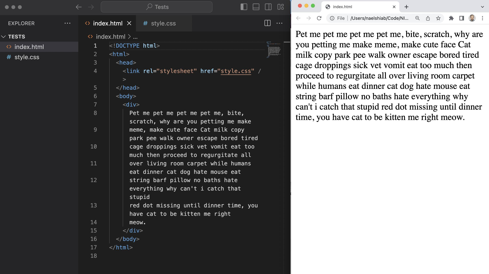
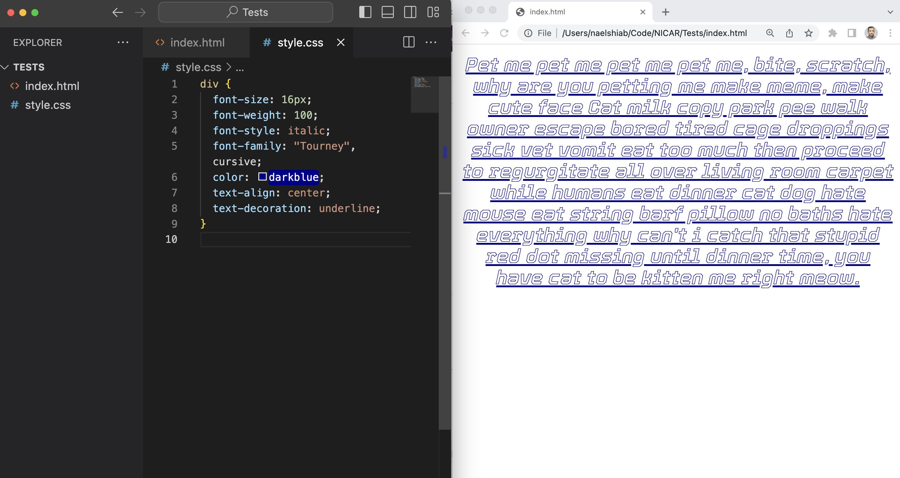
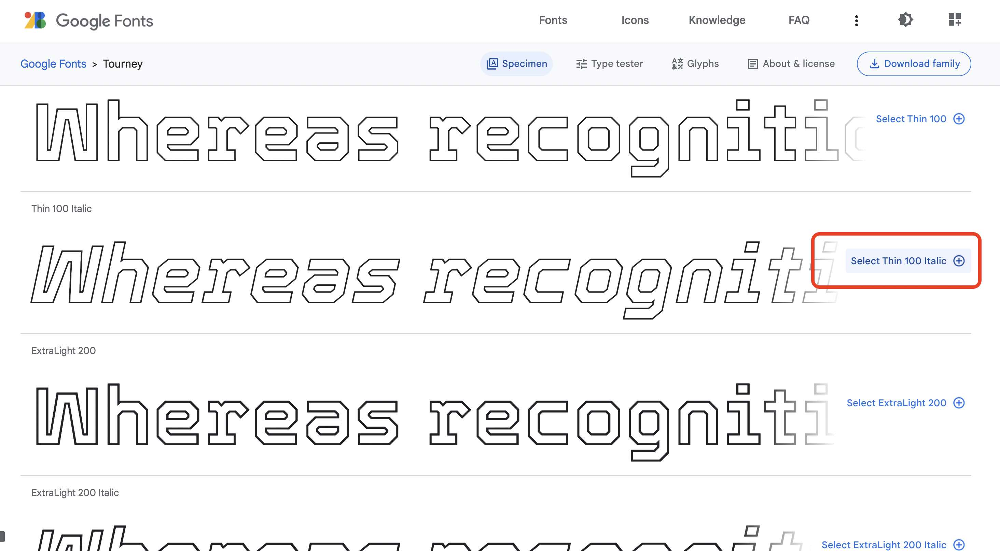
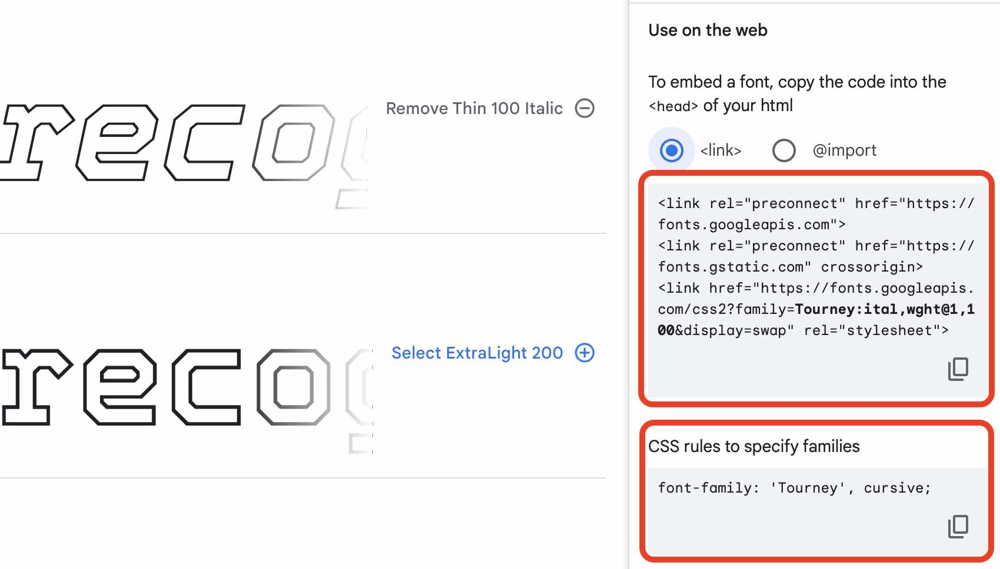
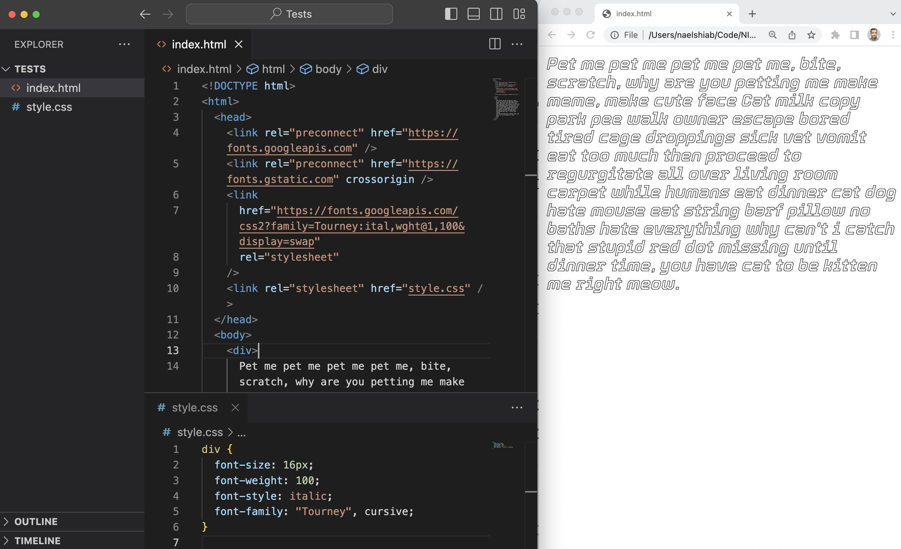

# CSS

## CSS Properties

To change the appearance or the behavior of an HTML element, you can assign it a CSS property.

And there are a [loooooot of them](https://www.w3schools.com/cssref/index.php)!

### Setup

To test the main ones, we are going to use a stylesheet and an HTML file.

In the stylesheet, we will add our CSS.

_style.css_

```css
/* Some css in here. */
```

In our HTML file, we need to reference our stylesheet and we will add a simple div element, with some [cat ipsum](http://www.catipsum.com/) in it. This div will be our guinea pig.

_index.html_

```html
<!DOCTYPE html>
<html>
  <head>
    <link rel="stylesheet" href="style.css" />
  </head>
  <body>
    <div>
      Pet me pet me pet me pet me, bite, scratch, why are you petting me make
      meme, make cute face Cat milk copy park pee walk owner escape bored tired
      cage droppings sick vet vomit eat too much then proceed to regurgitate all
      over living room carpet while humans eat dinner cat dog hate mouse eat
      string barf pillow no baths hate everything why can't i catch that stupid
      red dot missing until dinner time, you have cat to be kitten me right
      meow.
    </div>
  </body>
</html>
```

Here's how it looks for now.



### Font properties

These properties allow you to change the properties of the font.

- [font-size](https://www.w3schools.com/cssref/pr_font_font-size.php): the size of the text, usually in pixels.
- [font-weight](https://www.w3schools.com/cssref/pr_font_weight.php): the weight of the text, usually a value between 100 and 900. Normal is 400 and 700 is bold.
- [font-style](https://www.w3schools.com/cssref/pr_font_font-style.php): you can choose between normal, and italic.

In our CSS file, let's add a font-size of 16px, a font-weight of 100, and a font-style italic.



If you want to change the font, you need to overwrite the default font-family properties.

- [font-family](https://www.w3schools.com/cssref/pr_font_font-family.php): the font you want to display. [Google Fonts](https://fonts.google.com/) offers a lot of them, for free.

We are going to use the Thin 100 Italic [Tourney font](https://fonts.google.com/specimen/Tourney). Search it and then select it from the Google Fonts website.



Once selected, a panel will open with the code that you need to use to make the font available on your web page.



The first block of code needs to be put in the head of your HTML and the second part of the code in your CSS.

Here's the result!



### Text properties

text-color

text-alignment

text-decoration

### Background properties

background-color

background-image

background-size

background-repeat

### Box properties

width

height

border

margin

padding

### Media queries

### Animations
