# Introduction to JavaScript

Now that you've mastered the basic concepts of programming, learning any language is the same as learning a spoken lanugage. It's about understanding both the **vocabulary** and **syntax** of that language.

In programming, the **vocabulary** of a language are the keywords and symbols a language uses to refer to programming concepts. For example, the word `const` is JavaScript vocabulary for a variable, while Python doesn't have such a keyword.

The **syntax** of a language is how the vocabulary is strung together to create meaning. Putting a `+` sign between two numbers denotes an arithmetic operation, but putting the same symbol between two strings denotes a string operation. In both cases the vocabulary is the same, but the syntax of the language creates a different outcome (i.e. produces a different meaning). Then there's just the syntaxes of formality – in English you end sentences with a puncuation mark, in JavaScript you end each statement with a semicolon (`;`).

Vocabulary and syntax are concepts that you learn through practice, and unlike riding a bike, you do forget them if you haven't used them in a while, so it's important to understand how to find them again. This is why I've bolded so many concepts in the programming section like "defining a varible" or "invoking a function". These words are universal in programming languages and using them to ask questions of others or the internet is 50% of the battle.

Traditionally, this is the part where I teach you how to Google:

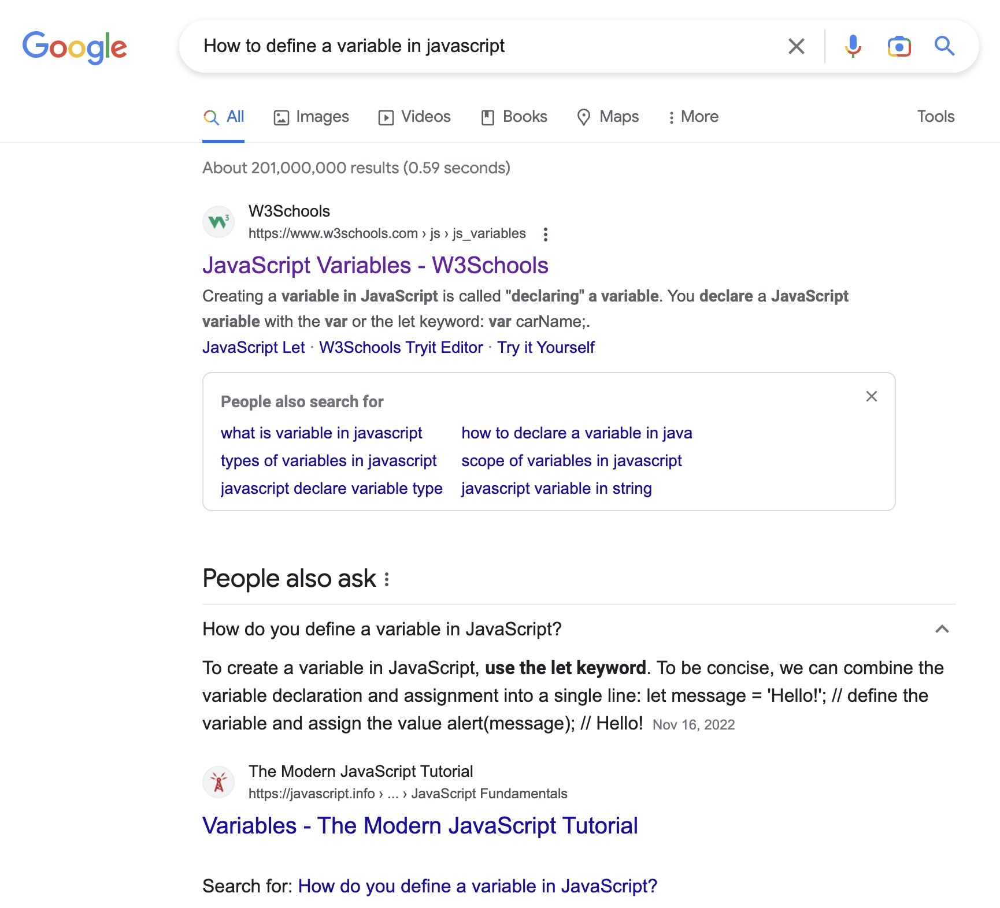
<br ><br >

But, I've actually come to realize that for most basic programming concepts, AI and large language models preform just as well as Google, but in a more digestible format. Compare the Google search above to just asking Chat-GPT the same question:

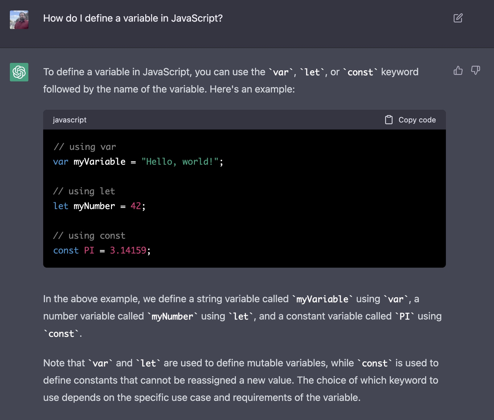
<br ><br >

You can even ask it the same question in a language your more comfortable with (mixing in the keywords in English) and have it give you a response in that language.
<details>
<summary>See it in Spanish!</summary>
<br>
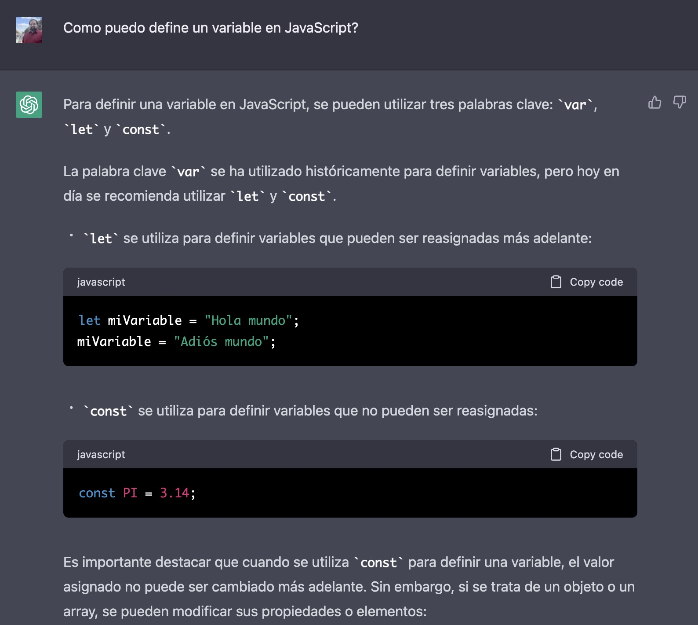
</details>
<br>


So the remainder of this section won't be a lesson like the others, it'll be a reference guide where I explain the JavaScript syntax and vocabulary for the concepts you learned in the previous section. But JavaScript is an everchanging language with usually more than one way to do something, so I encourage you to go out into the world of the internet and find alternatives, improvements, and strangely strong held opinions.

## JavaScript Taxonomy: Blocks, Statements, and Expressions
As alluded to earlier, all JavaScript statements should end in a semicolon (`;`), but what is a "statement"? In JavaScript, code is organized into three levels: 
- **Blocks**: A collection of statements enclosed in curly braces {}. Blocks are used to group statements together, and are used in decisions and loops.
- **Statements**: Complete units of code that perform an action. Typically, statements end with a semicolon (`;`). 
- **Expressions**: A combination of values, variables, and operators that produces a new value. Expressions can be (and sometimes must be) wrapped in parenthesis (`()`), but usually don't *need* to be.

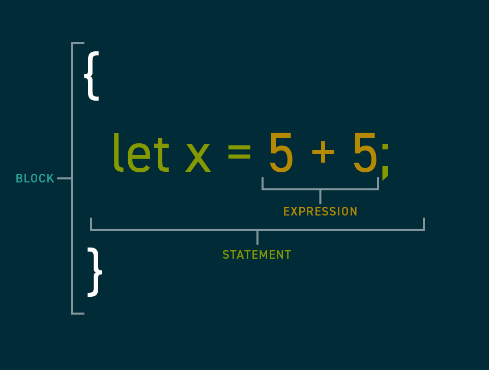

JavaScript is *usually* smart enough to figure out where you meant to put the semicolons, but not always so it's generally best practice to put them yourself. In practice, most modern programmers use tools to add them in for us (there's never a problem too small to automate).

## Naming
JavaScript has it's own rules for naming things in code. Note that you can always create strings which have no rules to the characters used in them. But in cases where you have to give a name to a function or variable, these are the rules
- They must begin with a letter, underscore (`_`), or dollar sign (`$`).
- After the first character, they can also contain numbers (0-9).
- They are case-sensitive, so `myVariable` and `myvariable` are different things.
- You cannot use the JavaScript keywords described in this section as names (e.g. var, function, if, etc.). Though you can use them as part of a larger name (e.g. `myvar`, `ifMobile`, etc.).

### Conventions & Casing
The four rules above are required for your code to work, but there's also a few rules that are considered good practice or convention.
- They should be descriptive and not too long.
- You should use camelCase for variable and function names (e.g. `myVariableName`) instead of underscores or hyphens.

## Value Types
| Type  | Syntax | Example |
| ------------- | ------------- | ------------- |
| String | Wrapped in quotes (like `"` or `'`), or backticks. Must use the same symbol to start and end.  | `"Hello World"`, `'He said "hello"'`. 
| Number | Use a period to separate decimal portion from whole portion, otherwise don't use other symbols like commas | `2`, `3.14`, `5632`
| Boolean | Write the text `true` or `false` in lowercase | `true`
| Undefined | Write the text `undefined` in lowercase | `undefined`
| Null/None | Write the text `null` in lowercase | `null`
| Array | See "Arrays" below | 
| Function | See "Operations" below | 
| Object | See "Objects" below | 

## Objects
Define objects with curly braces* (`{}`). 
```javascript
{}
```
<sub><sup>*Like many things in JavaScript, the meaning of code is contextual. Curly braces signify <em>both</em> a block and an object. If you start filling it with properties, it's an object. If you fill it with statements, it's a block. If you don't do either, it depends on how it's being used.</sup></sub>

Inside the curly braces, define each property with a unique name as a string. If the name follows the rules for naming explained above, you can skip using the quotes.

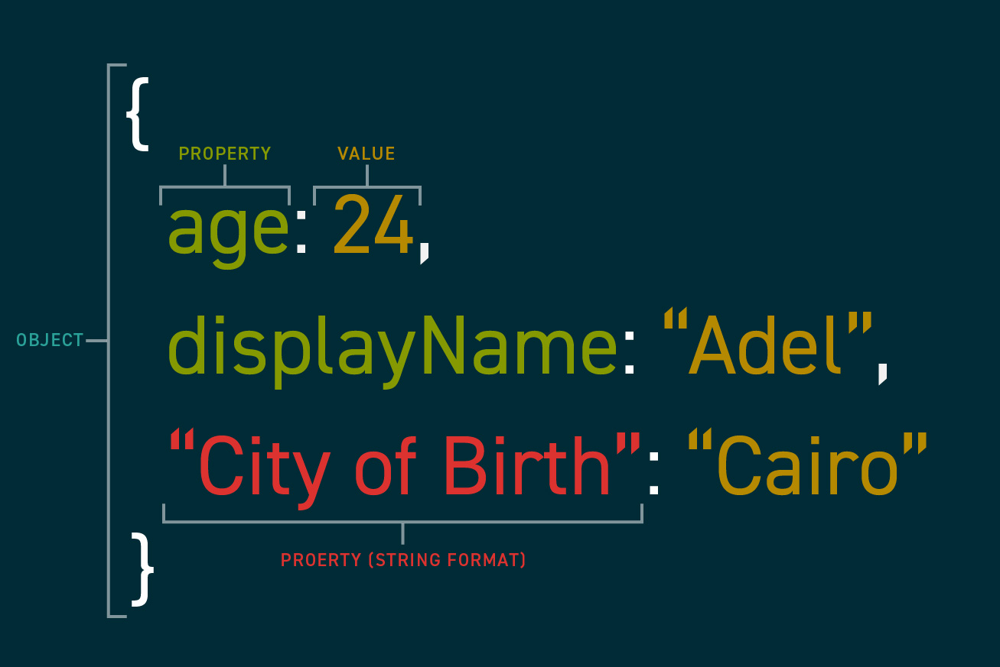

To refer to an object's properties you can use dot notation in which you write the name of the object (see "Variables"), then a period (`.`), and finally the name of the property. 
```javascript
person.displayName // "Adel"
``` 

If you made the property a string instead, however, you have to refer to it using bracket (`[]`) notation like so:
```javascript
person["City of Birth"] // "Cairo"
```

## Arrays
```javascript
[1, 2, 3, 4]
["Anne", "Jose", "Maria"]
```

In JavaScript, arrays are technically objects. This might seem like a distinction without a difference, but it's important to keep in mind. Once created, arrays have their own properties and methods (see "Operations"). Some common ones are:
- `length`: A property that returns the number of items in the array
- `push`: A method which takes a value and adds it to the array
- `includes`: A method which takes a value and returns whether or not that value can be found in the array.
- `join`: A method which combines all the values in an array into a string, joined together by the first argument provided.

```javascript
const myArr = [1, 2, 3, 4];
myArr.includes(1); // true
myArr.includes(6); // false
myArr.push(6);
myArr.includes(6); // true
myArr.length; // 5 ( because we added 6 to the original 4 items )
myArr.join("|"); // "1|2|3|4|6"
```

If you want to learn more about all the ways you can manipulate an array (or how something is possible), try searching for it on a search engine or AI langauge model.

## Variables
To declare a variable in JavaScript start with a variable keyword (either `let` or `const`), then the name of the varible (see "Naming"). To assign the variable (which you can do on the same line in JavaScript), follow up the declaration using an assignment operator, and finally the value of the variable (which can be of any type, see "Value Types").


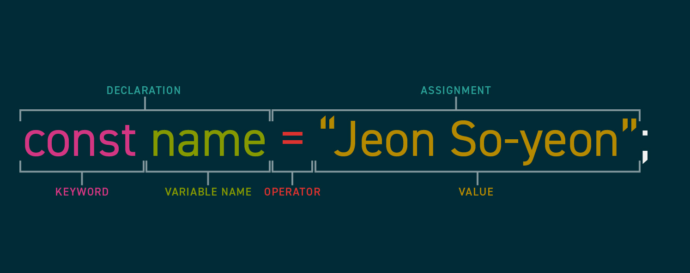

You can also set variables (or object properties) equal to other variables and it will make a copy of the value and save it in the new variable. Avoid doing this with objects (and arrays and functions), as it could have unintended consequences if you don't learn more about this.

```javascript
const name = "Jeon So-yeon";
const nameCopy = name;

const singer = {
  name: nameCopy
}

singer.name; // "Jeon So-yeon"

const otherSinger = singer; // Avoid this!!
```

### `let` vs `const`
JavaScript has three variable keywords to use when declaring a new variable (`let`, `const`, and `var`). Which one to use depends on how you plan to use it.

To start, never use `var`, it's a relic of a bygone era, but it still works because developers are nice to their past selves, and they didn't want a bunch of old legacy code to just start breaking.

Use `let` if you plan on re-assigning (or changing) the variable throughout the course of the program. If you think back to our example in the previous section, the `sum` variable kept track of the sum of all items in the list, but we had to calculate it one at a time increasing the value of the variable each time. That's a perfect use-case for `let`.

Use `const` if you don't plan on re-assigning the variable. For example, the drinking age in most of the United States is 21. If you were building a bartender robot, you could safely make that a const variable. It's likely not changing anytime soon, and if it does, you can update your program.

## Operations
As the bulk of what the programming language does, this section could go on for many pages. This will be just the surface of what JavaScript can offer in terms of operations and how to create operations (or functions and methods) of your own. The next section will cover how to bring in operations written by others into your code, and if you're ever not sure how to do something, remember to consult the internet.

For a full list of basic operations, check out [the MDN documentation on operators](https://developer.mozilla.org/en-US/docs/Web/JavaScript/Reference/Operators). The following tables will be a reference for common and beginner usecases.

### Assignment Operators
The common assignment operator in JavaScript are `=` when assigning variables and `:` when assigning property values. See "Variables" and "Objects" above for a better example of how they work.

### Arithmetic Operators
Basic Arithmetic can be preformed using these operators when the values on both sides of the operator are a number.
| Type  | Syntax | Example |
| ------------- | ------------- | ------------- |
| Addition | `+`  | `5 + 5 `
| Subtraction | `-` | `10 - 2`
| Division |`/` | `25 / 5`
| Multiplication | `*` | `2 * 2`
| [Exponentiation](https://developer.mozilla.org/en-US/docs/Web/JavaScript/Reference/Operators/Exponentiation) | `**` | `2 ** 2` 
| [Remainder](https://developer.mozilla.org/en-US/docs/Web/JavaScript/Reference/Operators/Remainder) | `%` | `8 % 2` 

### String Operators
The only commonly used string operator is the `+` sign which is used for **concatenation** or combining multiple strings together. Keep in mind concatenation combines the strings as they appear, it won't add spaces or other delimeters unless explicitly done so.
```javascript
const firstName = "Celia";
const lastName = "Cruz";
firstName + " " + lastName; // "Celia Cruz"
```

### Comparison Operators
Used to compare two values and return a boolean.
| Type  | Syntax | Example |
| ------------- | ------------- | ------------- |
| Equality* | `===`  | `5 === 5`, `age === 24`
| Inequality* | `!==` | `20 !== 5`
| Greater Than |`>` | `10 > 5`
| Less Than | `<` | `10 < 5`
| Greater Than or Equal To | `>=` | `2 >= 2` 
| Less Than or Equal To | `<=` | `5 <= 3`

<sub><sup>*You might see a different kind of (in)equality operator with one less equal sign (`==` vs `===` and `!=` vs `!==`). The short answer is don't use them. In nearly five years of professional programming, I've never purposefully used the shorter operator.</sup></sub>

### Logical Operators
Used to combine two comparison expressions into a single value. If this is your first time dealing with "Boolean Logic", it's a whole concept of its own. I recommend checking out [this guide](https://www.codecademy.com/resources/blog/what-is-boolean-logic/). In summary, logical operators are used to see if *all* of a set of comparisons are true, *any* of the comparisons are true, or if the comparison is *not* true.
| Type  | Syntax | Example |
| ------------- | ------------- | ------------- |
| Not | `!`  | `!true`
| And | `&&` | `score < 80 && score > 70` 
| Or | `\|\|` | `alcohol === null \|\| age > 21`

<br >

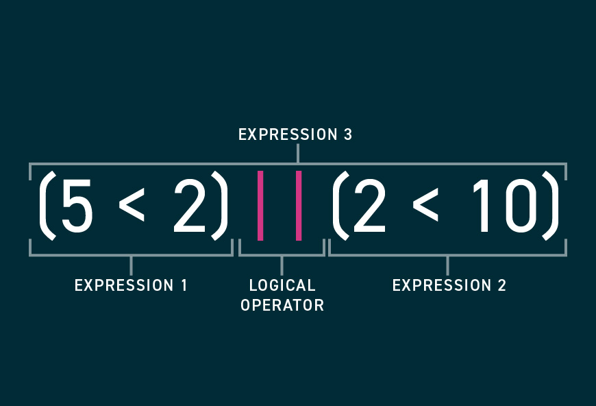
<br >
<sub><sup>In the above example, "Expression 1" evaluates to <code>false</code> and "Expression 2" evaluates to <code>true</code>. Because "Expression 3" uses the <code>or</code> operator, only one of the two underlying expressions need to be true. Therefore, "Expression 3" also evaluates to <code>true</code>.</sup></sub>

### Functions
Functions are a bit of prewritten code that you can invoke to preform the same code over and over. This code could come with the language, be written by you, or be written by someoone else and brought into your code.

To **invoke** a function use it's name and supply arguments in parenthesis (`()`).

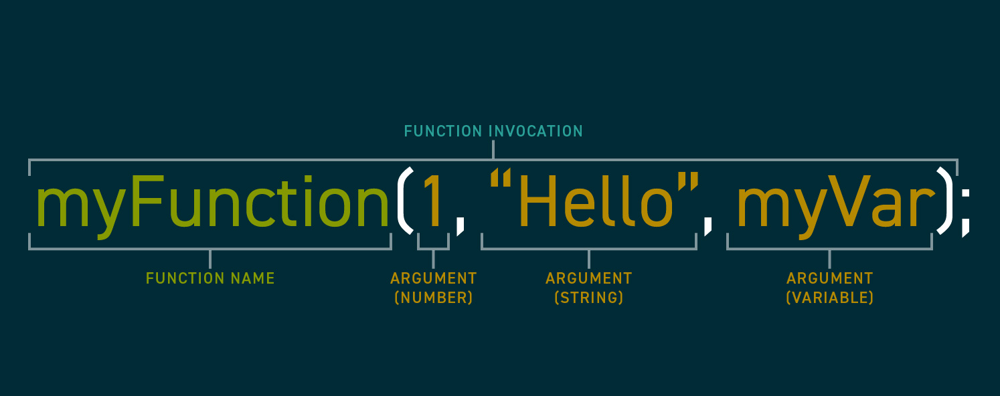

To **define** a function, use the keyword `function` and create a new block which will be executed when the function is invoked. Use the `return` keyword in the block to have the result of invoking this function return a value. You can then save these returns as new variables (see "Assigning From Returns" below).

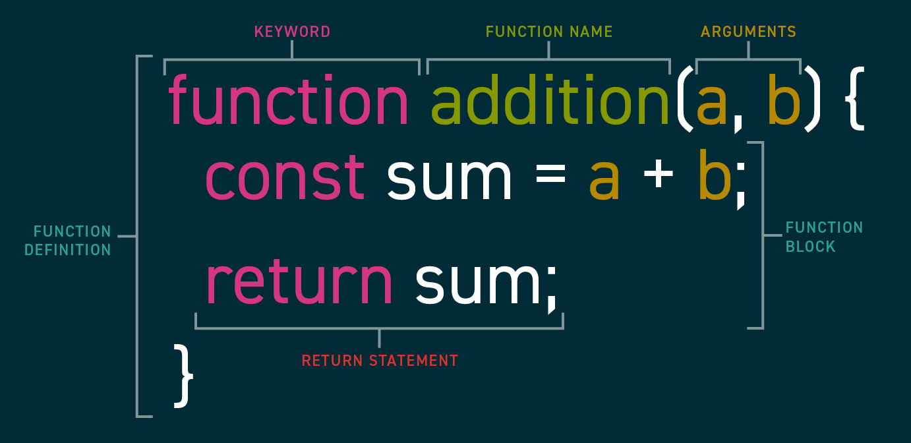


You can also use the keyword `return` by itself to end execution early or to return a particular value. If you don't use `return`, execution will end after the last statement and nothing will be returned.
```javascript
function greet(age){
  if(age < 21) {
    alert("You're not old enough!")
    return;
  }

  alert("What can I get you?");
}
```

### Methods
When the property of an object is a function, it's called a method. They are defined like any other property and function:
```javascript
const dog = {
  color: "gray",
  bark: function bark(){
    alert("Whoof!");
  }
}
```

And they are invoked by combining dot notation (see "Objects") and the usual way of invoking a function:

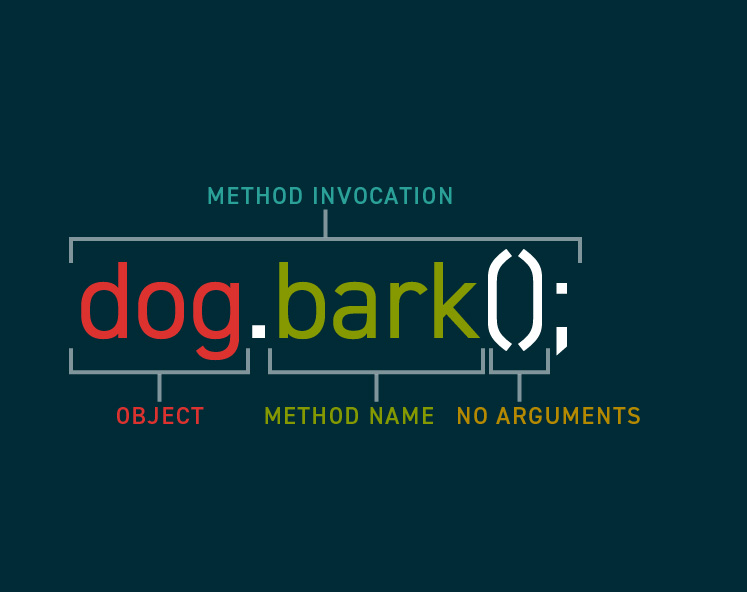


### Assignment From Return Value
As explained above, the assignment operator can be used to assign a value to a variable. But you can also preform an operation and save the value that function returns as a variable:
```javascript
const sum = 5 + 10; // 15
const name = "Anthony" + " " + "Bourdain"; // "Anthony Bourdain"
const value = Math.sqrt(4); // 2
```

### "Chaining" Methods
One common characteristic of methods is that they can be **chained** or called one after another. For example, arrays have the `.join` method which returns a string with all of the text in an array combined in a single string with a delimeter passed in as an argument. Strings have a method called `.replace` which replaces the first instance of a particular search value with a replacement value. Because of that, both of these code snippets produce the same output
```javascript
const example = [1, 2, 3, 4];

/* Without Chaining */
const asString = example.join('|');
const withReplace = asString.replace(1, 'H');
alert(withReplace); // "H|2|3|4"

/* With Chaining */
alert(
  example
    .join('|')
    .replace(1, 'H')
);
```

## Conditionals
In JavaScript, decisions are often called **conditionals**. They are coded using `if/else` statements. All decisions must start with the javascript keyword `if`. Follow that up with something called a **condition**. Conditions are simply booleans or expressions that return a boolean that is wrapped in parenthesis (`()`). Finally, create a new block (`{}`). The statements in the block following an if statement will only execute if the condition is true (technically if it's "truthy" but that's a concept for later). 

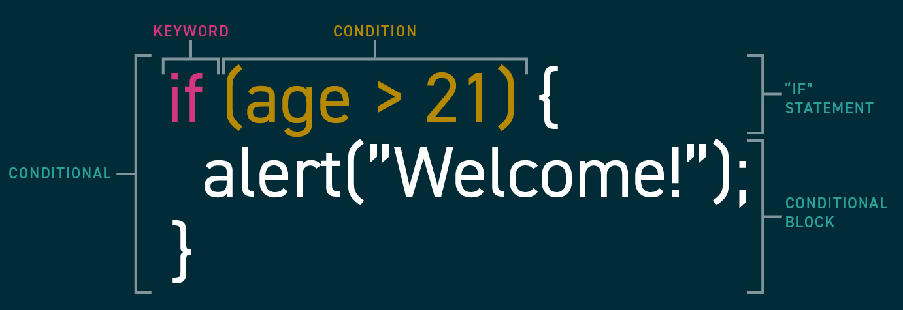

Technically, all you need to make decisions in JavaScript is if statements, but there are two more concepts that will help you code more concisely.

### Else If
Immediately after an `if` block, you can use the `else if` keywords in combination, followed by a condition, and another block. This block's statements will only be executed if the proceeding conditions were *not* met, but it's condition was. You can chain as many of these `else if` blocks as you want to cover as many conditions as necessary.

```javascript
if (noAlcohol) {
  alert("Here you go!");
} else if (age > 21) {
  alert("Here you go!");
} else if (country === "Mexico") {
  alert("Here you go!");
}
```

### Else
Immediately after an `if` or `else if` block, you can use the `else` keyword and start a new block. This block's statements will only be executed if none of the proceeding conditional blocks executed.

```javascript
if (noAlcohol) {
  alert("Here you go!");
} else if (age > 21) {
  alert("Here you go!");
} else {
  alert("No can do!");
}
```

## Loops
Most languages have a few different ways to create code loops. In the interest of efficiency I'm going to show you the most versatile one, the `for...of` loop.

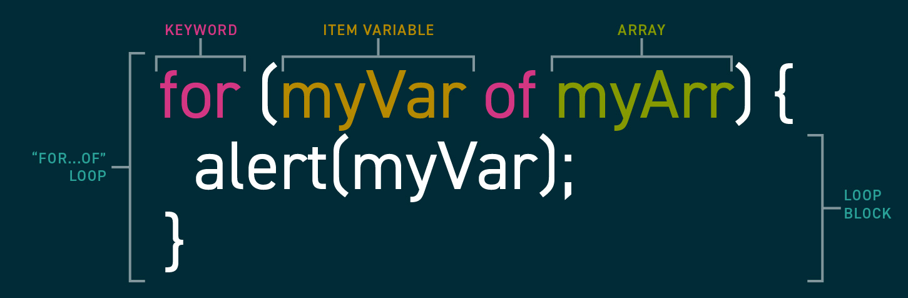

The `for...of` loop **iterates** or cycles through each item in an array and runs the code in the attached block. While executing statements in that block, you have access to a new variable (which you declare in the `for...of` statement). This new variable represents the item from the array in the current iteration.

Take this basic example which will alert each of the three names one by one:
```javascript
const names = ["Eren", "Mikasa", "Armin"];

for(name of names) {
  alert("Now looking at " + name);
}
```

But what if you don't have an array to iterate though? What if you simply want to loop something ten times? The reality is that's fairly rare, but not unheard of. While there's other loops to use in those situations, there's actually no harm in *creating* a new array to accomplish that.

To create a loop where the variable is an integer from 0 to X, simply use this code replacing the value of `length` with a number one higher than your desired upper limit (e.g. for a loop from 0 – 10, use a length of 11):
```javascript
for(num of Array.from({ length: 5 }).keys()){
  alert(num);
}
```

## Your Turn!
**Excercise 9 – Coding in JavaScript.** In the previous section, you used Scratch to design a script that grades a set of test scores. Now, translate that design into JavaScript.
