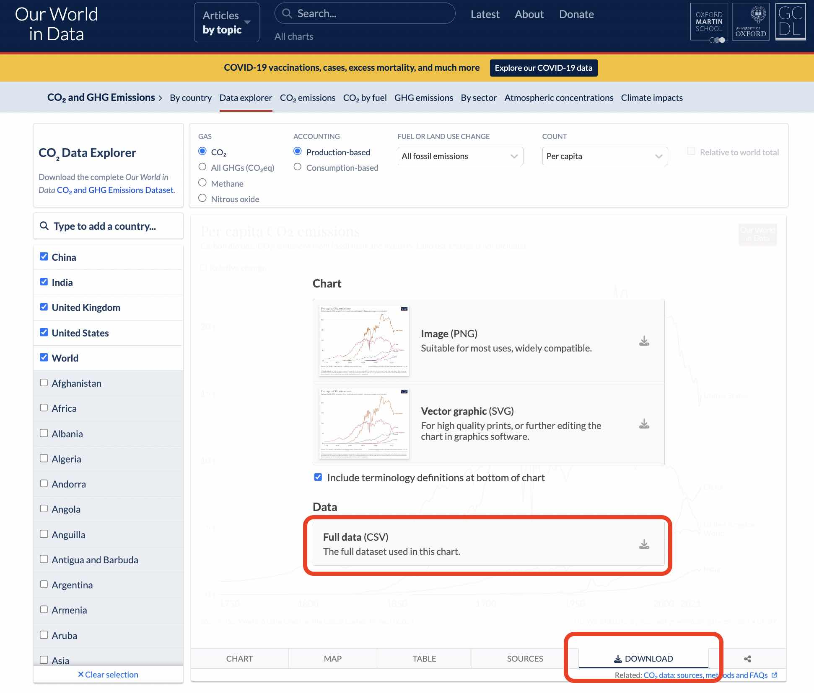

# Loading data

As data journalists, we very often need to load data for our projects.

In this section, we will work with an HTML file _index.html_ and a JavaScript file _load-data.js_.

In our HTML file, we link our JavaScript file in HEAD, so it will be loaded and triggered on our webpage.

_index.html_

```html
<!DOCTYPE html>
<html>
  <head>
    <script src="load-data.js"></script>
  </head>
  <body></body>
</html>
```

And in our JavaScript file, we log "Hi!" just to make sure everything works.

_load-data.js_

```js
console.log("Hi!");
```

Open your HTML file in your browser and open the console (in the top menu, click on "View", then "Developer", then "Developer tools", and choose the "Console" tab). If you see "Hi!" being logged, you are ready!


## With a local file

Most of the time, you have some data locally that you want to load on your page. But for security reasons, browsers will block you from loading it without a local server.

We need an extra setup step. If it's not already installed on your browser, install the [Web Server for Chrome extension](https://chrome.google.com/webstore/detail/web-server-for-chrome/ofhbbkphhbklhfoeikjpcbhemlocgigb/related?hl=en).


Once installed, launch it. A pop-up may tell you that the extension is no longer supported. It's fine. Open it anyway.


The last thing to do is to choose the folder in which you have your HTML and JS code.


Click on the web server URL (http://127.0.0.1:8887 in my case, you might have something slightly different), open the console, and you should see "Hi!" being logged.

A local server simulates the web, which is very handy when developing web projects while keeping everything on your computer.

We are ready!

For the data, we are going to use the [per capita C02 emissions from Our World in Data](https://ourworldindata.org/explorers/co2?facet=none&Gas=CO%E2%82%82&Accounting=Production-based&Fuel+or+Land+Use+Change=All+fossil+emissions&Count=Per+capita).

Click on the "Download" tab at the bottom, then on "Full data". I also put the data in this repository. You can find it at "./03_JAVASCRIPT/03_LOADING_DATA/data/co2.csv".



Move the file to your coding folder, and then add the code below to _loading-data.js_.

On the first line, we create the asynchronous (don't worry about that for the moment) function _main_.

On the second line, we fetch our local file with its relative path (this is why it starts with "./"). We use _await_ because we want to retrieve all of the data before running the rest of our script.

On the third line, we parse the fetch response as text. Again, we use _await_.

On the fourth line, we log the result.

Now, all of these lines are creating the _main_ function, but not running it. We need to trigger it. So our last line is _main()_.

```js
async function main() {
  const response = await fetch("./co2.csv");
  const csv = await response.text();
  console.log(csv);
}

main();
```

If you refresh your browser (with the URL from your local server), you should see your data being logged! That's amazing, right?


## From a URL

Now, how could we load data if it's hosted somewhere on the web? If we don't have the file locally?

Easy! Just replace the relative path ("./co2.csv") by the URL pointing to the data you want to retrieve.

I pushed the data in the repo. Here's its URL: https://raw.githubusercontent.com/CarlaAstudillo/nicar-2023-intro-to-web-dev/main/03_JAVASCRIPT/data/co2.csv?token=GHSAT0AAAAAABZZXWCAGZ2M6YFA5ET7JNBUY7SJGCQ.

You can also find the URL directly on the repo GitHub page. Don't forget to click on the "Raw" button, to go to the raw data. Otherwise, it won't work.


Your code should look like this.

```js
async function main() {
  const response = await fetch(
    "https://raw.githubusercontent.com/CarlaAstudillo/nicar-2023-intro-to-web-dev/main/03_JAVASCRIPT/data/co2.csv?token=GHSAT0AAAAAABZZXWCAGZ2M6YFA5ET7JNBUY7SJGCQ"
  );
  const csv = await response.text();
  console.log(csv);
}

main();
```

And you show see the being logged again, except this time, you retrieved it from the web!


Be careful when loading data from the web. For your projects, only load data from servers that you control and own.

If your project ends up having millions of page views, you will flood the hosting server with... millions of requests! It's not very nice to do that to someone else. If it's your server, you can expect it and deal with it.

If the people hosting the data remove it or change its URL, your project won't work anymore. If it's your server, this won't happen unless you make the change.
