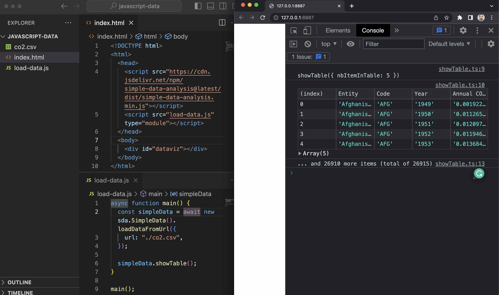

# Using libraries

> This section is the continuation of 03_JAVASCRIPT/03_LOADING_DATA.

In the previous section, we retrieved a CSV file with JavaScript. But there's a problem: CSV data is just text! We can't work with data in this format. To help us convert it, we are going to use open-source libraries.

Most open-source JavaScript libraries (or modules) are hosted on GitHub and are maintained by thousands of developers like you. Some are paid. Many are volunteers. These libraries are invaluable and are powering pretty much everything that involves code, for free.

## Setup

After the previous section, our code looked like this and we are going to reuse it. Don't forget to launch the Web Server extension!

_index.html_

```html
<!DOCTYPE html>
<html>
  <head>
    <script src="load-data.js"></script>
  </head>
  <body></body>
</html>
```

_load-data.js_

```js
async function main() {
  const response = await fetch(
    "https://raw.githubusercontent.com/CarlaAstudillo/nicar-2023-intro-to-web-dev/main/03_JAVASCRIPT/data/co2.csv"
  );
  const csv = await response.text();
  console.log(csv);
}

main();
```

In your browser, if you open the local link to your project (from the Web Server extension, something like http://127.0.0.1:8887/), you should see the CSV data being logged in the console.


## D3

D3 (Data-Driven Document) is a well-known library, very often used for data visualization. But it also has a lot of very useful functions to wrangle data.

D3 is broken down into multiple modules and one that would be very useful for us is [d3-fetch](https://github.com/d3/d3-fetch). There's a function called _csv_ that "loads and parses a CSV file". Perfect for us!


The best way to know how to use a library is to read the documentation. Very often, the instructions will be in the GitHub repository README. For the _csv_ function of the d3-fetch module, it's quite straightforward.


In our HTML file, we first need to specify the type of our _load_data.js_ as a module.

```html
<!DOCTYPE html>
<html>
  <head>
    <script src="load-data.js" type="module"></script>
  </head>
  <body></body>
</html>
```

We can then import the _csv_ function from d3-fetch in _load-data.js_. For convenience, the module is hosted on [skypack.dev](https://www.skypack.dev/), which allows us to load it directly into our web page.

Now, we can replace _fetch_ with _csv_ on line 4. We can also rename _response_ to _data_.

There's no need for _const csv = await response.text()_ anymore, because the _csv_ function is doing all of the work for us!

In the console.log, we can replace our old _csv_ variable by our brand-new _data_ variable.

Your JavaScript code should look like this now.

```js
import { csv } from "https://cdn.skypack.dev/d3-fetch@3";

async function main() {
  const data = await csv(
    "https://raw.githubusercontent.com/CarlaAstudillo/nicar-2023-intro-to-web-dev/main/03_JAVASCRIPT/03_LOADING_DATA/data/co2.csv"
  );
  console.log(data);
}

main();
```

And if you reload the page, you can see that the data is not a big string now. It's a list of 26,915 items! And by clicking on the little arrows (outlined in red), you can inspect each one.

You can see that each row of the CSV file became a JavaScript object, with the keys of the object being the CSV column names.

That's perfect! An array of objects is easy to manipulate and very flexible to work with.


Congrats! You now know how to use external libraries. A whole new world is at hand! :)

## Simple Data Analysis

Let's play with another library: [simple-data-analysis](https://github.com/nshiab/simple-data-analysis.js). Full disclaimer: I am its maintainer. (^\_^)

If we check the documentation, we can see that there are a lot of useful functions to clean, analyze and visualize data.

Let's create a chart with it!

First, according to the documentation, we need to import the library into our HTML file.

We can remove the _type="module"_ on our _load-data.js_ for the moment. It won't have any effect.

We also create a div with the id "dataviz". We will put the chart in it.

```html
<!DOCTYPE html>
<html>
  <head>
    <script src="https://cdn.jsdelivr.net/npm/simple-data-analysis@latest/dist/simple-data-analysis.min.js"></script>
    <script src="load-data.js"></script>
  </head>
  <body>
    <div id="dataviz"></div>
  </body>
</html>
```

In our JavaScript file, we can now create a new instance of the SimpleData class, from the sda variable (short for simple-data-analysis).

To load our data, we can use the method loadDataFromUrl and pass the relative path to our file _co2.csv_. But it could be an external URL as well.

The library will fetch the data, parse it and keep it in memory in the _simpleData_ variable.

To see the result, we can call the showTable method. And a table with our data will appear in the console. Quite handy!

```js
async function main() {
  const simpleData = await new sda.SimpleData().loadDataFromUrl({
    url: "./co2.csv",
  });

  simpleData.showTable();
}

main();
```



In the table, we can see that the "Year" and the "Annual CO₂ emissions (per capita)" are strings. But to draw our chart, we need them to be numbers. With the methods _valuesToInteger_ and _valuesToFloat_, we can convert them easily.

```js
async function main() {
  const simpleData = await new sda.SimpleData().loadDataFromUrl({
    url: "./co2.csv",
  });

  simpleData
    .valuesToInteger({ key: "Year" })
    .valuesToFloat({ key: "Annual CO₂ emissions (per capita)" })
    .showTable();
}

main();
```

Now, they are numbers!


It's time to draw our chart.

First, we remove our _showTable_ call. We don't need it anymore.

Then we retrieve our div _dataviz_ by using _document.querySelector_. We will replace its content (_innerHTML_) with our chart.

We call the method _getChart_ on our SimpleData instance to create a line chart, with "Year" as x and "Annual CO₂ emissions (per capita)" as y. The type of the chart is "line" and we want to have a different color for each "Entity".

```js
async function main() {
  const simpleData = await new sda.SimpleData().loadDataFromUrl({
    url: "./co2.csv",
  });

  simpleData
    .valuesToInteger({ key: "Year" })
    .valuesToFloat({ key: "Annual CO₂ emissions (per capita)" });

  document.querySelector("#dataviz").innerHTML = simpleData.getChart({
    x: "Year",
    y: "Annual CO₂ emissions (per capita)",
    type: "line",
    color: "Entity",
  });
}

main();
```

If you reload the page, you'll see that there are a lot of countries in the data!


It would be better to filter the data to keep only some of them.

Right after calling the method _valuesToFloat_, filter the "Entity" to include the countries of your choice. Make sure to use countries that appear in the chart legend.

```js
simpleData
  .valuesToInteger({ key: "Year" })
  .valuesToFloat({ key: "Annual CO₂ emissions (per capita)" })
  .filterValues({
    key: "Entity",
    valueComparator: (entity) =>
      [
        "Brazil",
        "Canada",
        "France",
        "Japan",
        "Russia",
        "United States",
      ].includes(entity),
  });
```

Well, that's much better, right?


And that's the end of the lesson! You used another JavaScript library to wrangle data. You can be proud of yourself! :)
